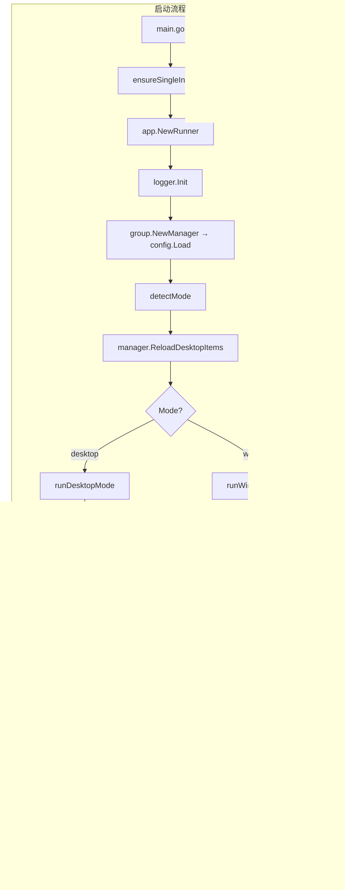

# DesktopGo Spec 索引

## Spec 文件列表

| 文件 | 用途 | 优先级 |
|------|------|--------|
| [spec-app-entry.md](./spec-app-entry.md) | 应用入口 / 单例保护 | P0 |
| [spec-runner.md](./spec-runner.md) | 运行器 / 模式检测 / 托盘 / 窗口模式 UI | P0 |
| [spec-config.md](./spec-config.md) | 配置数据结构和持久化 | P0 |
| [spec-group.md](./spec-group.md) | 分组 CRUD / 桌面同步 / 自动分类 | P0 |
| [spec-desktop-api.md](./spec-desktop-api.md) | Win32 API 封装 / 布局修复 | P0 |
| [spec-desktop-mode.md](./spec-desktop-mode.md) | 桌面模式全流程 / Z 序守护 | P0 |
| [spec-window-mode.md](./spec-window-mode.md) | 窗口模式网格布局 | P1 |
| [spec-group-card.md](./spec-group-card.md) | 分组卡片 / 8 方向缩放 / 拖拽 | P1 |
| [spec-icon-tile.md](./spec-icon-tile.md) | 图标磁贴规格 / 长按拖拽 | P1 |
| [spec-icon.md](./spec-icon.md) | 图标提取 / LNK 解析 / 缓存 | P1 |
| [spec-dialogs.md](./spec-dialogs.md) | 对话框 / 颜色选择器 | P1 |
| [spec-program.md](./spec-program.md) | 程序执行器 | P1 |
| [spec-wallpaper.md](./spec-wallpaper.md) | 壁纸三级回退 | P1 |
| [spec-lifecycle.md](./spec-lifecycle.md) | 三态生命周期 | P0 |
| [spec-logger.md](./spec-logger.md) | 日志封装规范 | P1 |
| [spec-tile-size-measurement.md](./spec-tile-size-measurement.md) | 磁贴尺寸测量重构经验总结 | - |
| [spec-context-menu.md](./spec-context-menu.md) | 桌面右键菜单 / 注册表 Shell 集成 | P0 |
| [spec-cross-process-dragdrop.md](./spec-cross-process-dragdrop.md) | 进程间拖放 / 外部文件拖入与拖出 | P1 |
| [spec-system-events.md](./spec-system-events.md) | 系统事件恢复 / 电源/显示监听 / 定时自检 | P0 |

## 全局数据流

## 已知问题 / TODO

| ID | 优先级 | 描述 | 状态 |
|----|--------|------|------|
| TODO-1 | P1 | `internal/ui/desktop_api.go` 中的 `GroupItem` 与 `internal/group/manager.go` 重复 | ✅ 已修复 |
| TODO-2 | P1 | `internal/ui/program.go` 中的 `CollectDesktopPaths()` 是死代码（未被调用） | ✅ 已清理 |
| TODO-3 | P1 | `internal/group/manager.go` 中的 `desktopItemInfo` 和 `ui.DesktopItem` 未统一 | ✅ 已统一 |
| TODO-4 | P2 | 卡片操作按钮（重命名、颜色、删除）尚未绑定点击事件 | ✅ 已实现 |
| TODO-5 | P2 | 双击打开项目（分组内）尚未实现 | ✅ 已实现 |
| TODO-6 | P2 | SPEC.md 中 GUI 框架写为 Fyne，实际为 lxn/walk | 待修正 |
| TODO-7 | P1 | healthcheck 频繁 re-embedding（8h 约 960 次），WorkerW 频繁重建可能影响 Explorer 稳定性 | 待优化 |
| TODO-8 | P1 | `refreshDesktop()` 触发 `ReloadDesktopItems` 可能导致桌面项分组意外变更 | ✅ 已修复 |
