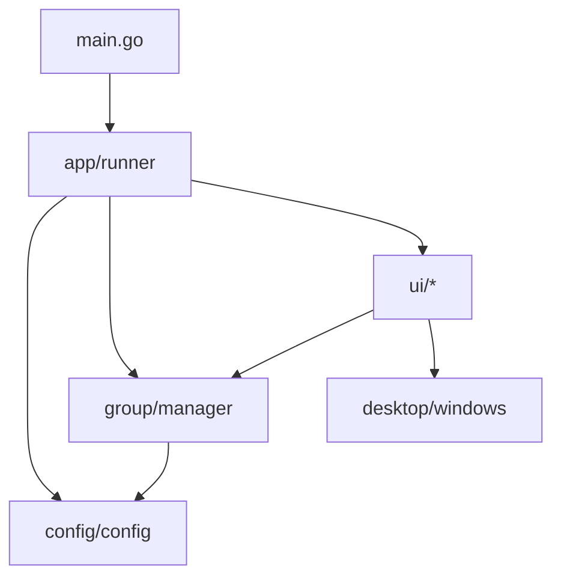
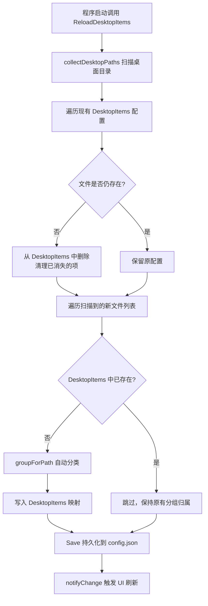
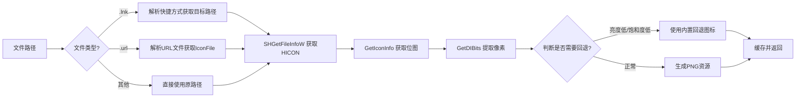

# DesktopGo - 桌面分组管理系统规格说明书

## 1. 项目概述

| 属性 | 描述 |
|------|------|
| **项目名称** | DesktopGo |
| **版本** | 1.0.0 |
| **开发语言** | Go 1.21+ |
| **GUI框架** | Fyne v2.5.0 |
| **目标平台** | Windows (win32) |
| **项目定位** | Windows 桌面图标分组管理与桌面美化工具 |

### 1.1 功能简介

DesktopGo 是一款 Windows 桌面分组管理器，通过**卡片式分组**将桌面的文件、文件夹、快捷方式进行分类整理。支持两种运行模式：
- **窗口模式**：独立的窗口应用程序
- **桌面替换模式**：全屏覆盖桌面，提供类似桌面壁纸的效果

---

## 2. 架构设计

### 2.1 项目结构

```
desktop_go/
├── main.go                      # 应用入口
├── go.mod                       # Go 模块定义
├── build.bat                    # 构建脚本
├── internal/
│   ├── app/
│   │   └── runner.go            # 应用运行器、模式检测、系统托盘
│   ├── config/
│   │   └── config.go            # 配置加载与持久化（JSON）
│   ├── desktop/
│   │   └── windows.go           # Win32 API 封装（窗口操作、屏幕信息）
│   ├── group/
│   │   └── manager.go           # 分组数据管理、桌面项同步
│   ├── logger/
│   │   └── logger.go            # 日志封装（基于 zap）
│   └── ui/
│       ├── program.go           # 程序执行器、图标获取
│       ├── desktop_mode.go      # 桌面模式 UI（卡片、拖拽、缩放）
│       ├── draggable_icon.go    # 可拖动图标组件
│       ├── windows_icon.go      # Windows 图标提取（SHGetFileInfo）
│       ├── window_state.go      # 窗口模式状态管理
│       ├── group_card.go        # 分组卡片组件
│       ├── dialogs.go           # 对话框工具
│       ├── helpers.go           # 通用工具函数
│       ├── wallpaper.go         # 壁纸管理
│       └── desktop_api.go      # 桌面 API 接口定义
```

### 2.2 模块依赖关系



---

## 3. 运行模式

### 3.1 模式说明

| 模式 | 常量 | 启动参数 | 环境变量 | 说明 |
|------|------|----------|----------|------|
| 窗口模式 | `ModeWindow` | `--window` / `-w` （默认） | - | 标准窗口应用 |
| 桌面模式 | `ModeDesktop` | `--desktop` / `-d` | `DESKTOPGO_MODE=desktop` | 全屏无边框桌面 |

### 3.2 模式检测优先级

1. 命令行参数（最高优先级）
2. 环境变量 `DESKTOPGO_MODE`
3. 默认为窗口模式

### 3.3 桌面模式全屏定位规格

**核心要求**：
- **无边框**：完全移除标题栏和窗口边框，不允许出现任何白边/边框残留
- **铺满工作区**：窗口精确覆盖屏幕工作区（排除任务栏区域），不遮挡任务栏
- **不可最小化**：禁用最小化操作，用户只能通过系统托盘进行显示/隐藏切换
- **Z序最底层**：窗口始终位于所有普通程序窗口的下方，但在系统桌面（Desktop）的上层，表现类似"活动壁纸"

**尺寸来源**：
- 使用 `SystemParametersInfo(SPI_GETWORKAREA)` 获取**工作区矩形**（排除任务栏）
- 工作区即为用户可见的桌面区域，确保不覆盖任务栏

**Z序定位**：
- 使用 `SetWindowPos` 配合 `HWND_BOTTOM` 将窗口置于 Z 序最底层
- 窗口位于系统桌面 (Explorer Shell) 之上、其他所有应用程序窗口之下
- 需要持续维护 Z 序（当窗口被激活/点击时可能被提升，需重新设置为 BOTTOM）

**禁止最小化**：
- 移除窗口样式中的 `WS_MINIMIZEBOX` 标志
- 拦截 `WM_SYSCOMMAND` 中的 `SC_MINIMIZE` 消息
- 用户通过系统托盘菜单控制窗口的显示与隐藏

**实现方式**：
1. 获取工作区矩形（SPI_GETWORKAREA → left, top, right, bottom）
2. 调用 Resize 设置窗口尺寸为工作区宽高
3. Show 后通过 Win32 API 强制定位（需多次尝试对抗 Fyne 重置）：去边框 + MoveWindow 定位到工作区左上角
4. 调用 `SetWindowPos(hwnd, HWND_BOTTOM, ...)` 将窗口沉底
5. 移除 `WS_MINIMIZEBOX` 样式，拦截最小化命令

| 属性 | 值 |
|------|-----|
| 窗口位置 | 工作区左上角坐标（通常为 (0, 0)，多显示器或任务栏在顶部时可能不同） |
| 窗口尺寸 | 工作区宽 × 工作区高（排除任务栏） |
| 定位 API | Win32 MoveWindow(hwnd, workArea.left, workArea.top, workArea.width, workArea.height) |
| 边框处理 | SetWindowBorderless(hwnd) 移除所有边框、标题栏，确保无白边残留 |
| Z序控制 | SetWindowPos(hwnd, HWND_BOTTOM, ...) — 始终在最底层 |
| 最小化 | 禁用 — 移除 WS_MINIMIZEBOX + 拦截 SC_MINIMIZE |
| 重试策略 | 5次重试，间隔100ms，对抗 Fyne/GLFW 的位置/Z序重置 |

**注意事项**：
- 使用 `HWND_BOTTOM` 而非 `HWND_TOPMOST`，确保窗口在所有程序下方
- 需要处理窗口激活事件（`WM_ACTIVATE`/`WM_WINDOWPOSCHANGING`），防止窗口被意外提升到前台
- 无边框实现必须彻底清除 `WS_CAPTION | WS_THICKFRAME | WS_BORDER` 等样式，避免白边
- DPI 缩放环境下 Fyne 内部坐标为逻辑像素，但 MoveWindow/SetWindowPos 使用物理像素
- 初始化完成后调用 `lifecycle.MarkReady()` 标记就绪
- 用户交互（显示/隐藏）统一通过系统托盘菜单操作

---

## 4. 核心模块详细规格

### 4.1 配置模块 (`internal/config`)

**配置文件路径**: `%USERPROFILE%\.desktop_go\config.json`

**数据结构**:

| 类型 | 字段 | 说明 |
|------|------|------|
| Config | Groups | 分组列表 |
| Config | DesktopItems | 桌面项路径 -> 分组名 映射 (map) |
| Group | Name | 分组名称 |
| Group | Position | 位置 (X, Y) |
| Group | Size | 尺寸 (Width, Height) |
| Group | Color | 颜色值 (#RRGGBBAA) |

**默认分组配置**:
| 名称 | 默认位置 | 默认尺寸 | 颜色 |
|------|----------|----------|------|
| 快捷方式 | (32, 82) | 300×585 | #342333B8 |
| 备份文件 | (336, 82) | 304×234 | #A783BEB8 |
| Word | (642, 82) | 322×234 | #24A892B8 |
| 图片 | (336, 381) | 304×234 | #276BA6B8 |
| 桌面 | (642, 381) | 322×234 | #C54834B8 |

**API**:
- `Load() *Config` — 加载配置（不存在则使用默认值）
- `Save(cfg *Config) error` — 保存配置到文件

### 4.2 分组管理模块 (`internal/group`)

**核心类型**: `Manager`

**主要功能**:

| 方法 | 功能 |
|------|------|
| `CreateGroup(name, color)` | 创建新分组 |
| `DeleteGroup(name)` | 删除分组（保留磁盘文件） |
| `RenameGroup(oldName, newName)` | 重命名分组 |
| `AddItemToGroup(groupName, itemPath, itemName)` | 添加项目到分组 |
| `RemoveItemFromGroup(groupName, itemPath)` | 从分组移除项目 |
| `MoveItemToGroup(itemPath, groupName)` | 移动项目到指定分组 |
| `MoveItemToDesktop(itemPath)` | 将项目移出分组到桌面区域 |
| `UpdateGroupPosition(name, x, y)` | 更新分组位置并持久化 |
| `UpdateGroupSize(name, w, h)` | 更新分组尺寸并持久化 |
| `UpdateGroupColor(name, color)` | 更新分组颜色并持久化 |
| `ReloadDesktopItems()` | 从 Windows 桌面目录重新同步内容 |
| `SetOnChange(fn)` | 设置变更回调函数 |

**桌面项分类规则** (`groupForPath`)：

| 文件类型 | 匹配条件 | 默认分组 |
|----------|----------|----------|
| 快捷方式 (.lnk, .url, .exe) | 扩展名匹配 | 快捷方式 |
| 文件夹 | isDir=true | 备份文件 |
| 文档 (.doc, .txt, .pdf等) | 扩展名匹配 | Word |
| 图片 (.png, .jpg等) | 扩展名匹配 | 图片|
| 名称包含"快捷" | 名称模糊匹配 | 快捷方式 |
| 名称包含"文件"或"备份" | 名称模糊匹配 | 备份文件 |
| 名称包含"word"或"文档" | 名称模糊匹配 | Word |
| 名称包含"图片" | 名称模糊匹配 | 图片 |
| 其他（含名称包含"桌面"） | 兜底规则 | 桌面 |

#### 4.2.1 启动时桌面同步与查漏补缺机制

**核心原则：每次启动程序时，必须根据系统桌面目录的实际内容，对本地配置进行查漏补缺。**

**触发时机**：`NewRunner()` 构造函数中，模式检测完成后立即调用 `ReloadDesktopItems()`。

**同步流程** (`ReloadDesktopItems`)：



**桌面目录扫描** (`collectDesktopPaths`)：

| 扫描目录 | 路径 | 说明 |
|----------|------|------|
| 用户桌面 | `%USERPROFILE%\Desktop` | 当前用户的个人桌面 |
| 公共桌面 | `C:\Users\Public\Desktop` | 所有用户共享的公共桌面 |

**扫描过滤规则**：
- 跳过 `desktop.ini` 系统文件
- 结果按文件名字母序排序
- 同时记录文件路径、显示名称、是否为目录

**查漏补缺逻辑详解**：

| 操作 | 触发条件 | 处理方式 | 说明 |
|------|----------|----------|------|
| **清理** | `DesktopItems` 中的路径在磁盘中不存在 | 从 map 中删除该项 | 用户手动删除了桌面文件，同步移除配置记录 |
| **新增** | 桌面目录中发现新文件，且 `DesktopItems` 中无记录 | 通过 `groupForPath` 自动分类后添加 | 新复制/新建到桌面的文件自动归组 |
| **保留** | 文件仍存在于桌面且已有分组记录 | 不做任何修改 | 维持用户的自定义分组调整 |

**首次启动 vs 后续启动对比**：

| 场景 | DesktopItems 初始状态 | 行为 |
|------|----------------------|------|
| 首次启动（无配置文件） | 空 map `{}` | 所有桌面文件均为"新增"，全部通过 `groupForPath` 自动分类 |
| 后续启动（有配置文件） | 包含历史记录的 map | 增量同步：只处理新增和消失的文件，保留既有分组归属 |

**持久化时机**：同步完成后立即调用 `config.Save()` 写入 `%USERPROFILE%\.desktop_go\config.json`，确保重启不丢失。

### 4.3 桌面 API 模块 (`internal/desktop`)

**Windows API 封装** (`WindowsAPI` 结构体):

| 方法 | 功能 |
|------|------|
| `GetScreenSize()` | 获取屏幕分辨率 |
| `GetVirtualScreenSize()` | 获取虚拟屏幕尺寸（多显示器） |
| `GetWorkAreaRect()` | 获取工作区矩形（排除任务栏） |
| `FindWorkerW()` | 查找桌面 WorkerW 窗口句柄 |
| `SetAsDesktopChild(hwnd)` | 将窗口设为桌面子窗口 |
| `SetWindowBorderless(hwnd)` | 移除窗口边框（标题栏等） |
| `MoveWindow(hwnd, x, y, w, h)` | 移动/调整窗口 |
| `SetWindowFullScreen(hwnd, ...)` | 设置窗口全屏 |
| `HideTaskbar()` / `ShowTaskbar()` | 隐藏/显示任务栏 |
| `ForceShowAndRaise(...)` | 强制显示并置顶 |

**使用的 Win32 DLL**:
- `user32.dll`: FindWindow, SetParent, ShowWindow, SetWindowPos, GetSystemMetrics 等
- `kernel32.dll`: GetCurrentProcess

#### 4.3.1 窗口生命周期与系统消息处理策略

**状态机模型：**

```
┌────────────┐    初始化完成     ┌────────────┐   开始关闭    ┌────────────┐
│ Uninitialized │ ──────────────► │   Ready     │ ──────────► │  Closing    │
│  (未初始化)    │                 │  (运行中)     │             │  (关闭中)    │
└────────────┘                 └────────────┘             └────────────┘
      │                               │                           │
      │ 收到消息                       │ 收到消息                   │ 收到消息
      ▼                               ▼                           ▼
 直接return                      正常处理               仅处理关闭相关消息，
 不做任何操作                                            其余直接return
```

| 阶段 | 状态值 | 消息处理行为 | 说明 |
|------|--------|-------------|------|
| 未初始化 | `StateUninit` | 直接 `return`，不做任何处理 | 窗口句柄可能尚未就绪 |
| 运行中 | `StateReady` | 正常处理所有系统消息 | 默认工作状态 |
| 关闭中 | `StateClosing` | 仅允许 WM_CLOSE/WM_DESTROY/WM_QUIT 相关消息通过；其余一律 `return` | 防止关闭过程中产生新操作 |

**数据结构定义：**

| 类型 | 说明 |
|------|------|
| WindowLifecycle (int) | 窗口生命周期状态枚举 |
| StateUninit | 未初始化 |
| StateReady | 就绪，可正常处理消息 |
| StateClosing | 关闭中，仅处理退出相关消息 |

| LifecycleManager 字段 | 说明 |
|------|------|
| state | WindowLifecycle 当前状态 |
| stateMu | sync.RWMutex 读写锁 |
| onCloseFuncs | 关闭时执行的清理函数列表 |

**核心方法规格：**

| 方法 | 功能 |
|------|------|
| `MarkReady()` | 标记窗口初始化完成，切换为 `StateReady` |
| `MarkClosing()` | 标记开始关闭，切换为 `StateClosing` |
| `ShouldProcess(msgType uint32) bool` | 根据当前状态判断是否应处理该消息 |
| `RegisterCleanup(fn func())` | 注册清理函数（如卸载钩子、释放资源） |
| `ExecuteCleanups()` | 按注册逆序执行所有清理函数 |

**`ShouldProcess` 判断逻辑：**

| 状态 | 返回值 | 说明 |
|------|--------|------|
| StateUninit | false | 未初始化，一律不处理 |
| StateReady | true | 正常运行，全部处理 |
| StateClosing | 视消息类型 | 仅允许关闭相关消息通过：WM_CLOSE(0x0010), WM_DESTROY(0x0002), WM_QUERYENDSESSION(0x0011), WM_ENDSESSION(0x0016), WM_NCDESTROY(0x0082), WM_QUIT(0x0012)；其余返回 false |

**集成要点：**

1. **初始化阶段**（`runDesktopMode` / `runWindowMode`）：
   - 创建窗口时初始状态为 `StateUninit`
   - 所有延迟操作（去边框、定位、SetParent等）完成后调用 `MarkReady()`
   - 可选策略：在 `MarkReady()` 之前不挂载自定义系统消息回调（懒挂载）

2. **运行阶段**：
   - 所有系统消息回调入口处首先调用 `ShouldProcess(msgType)` 检查
   - 返回 `false` 则立即返回，不执行后续逻辑

3. **关闭阶段**：
   - 触发退出时先调用 `MarkClosing()`
   - 调用 `ExecuteCleanups()` 执行清理（卸载钩子、停止定时器等）
   - 最终销毁窗口

### 4.4 UI 模块 (`internal/ui`)

#### 4.4.1 桌面模式 (`DesktopMode`)

**UI 组件层次**:
```
DesktopMode Root Container
├── Background (canvas.Rectangle - 深色背景)
├── Wallpaper (canvas.Image - 壁纸图片)
└── Desktop Content Container
    ├── Toolbar ("+ 添加卡片"按钮)
    ├── Free Desktop Items (未分组的桌面图标)
    └── Group Cards (每个分组包含:)
        ├── Card Background + Shine Effect
        ├── Panel Header (标题栏 + 操作按钮)
        │   ├── [+添加] [✎重命名] [色:颜色] [×删除]
        │   └── Separator
        ├── Panel Body (图标网格，可滚动)
        │   └── DesktopIconTile × N
        └── Panel Footer (底部装饰)
    ├── Drag Handle (长按拖拽热区)
    └── Resize Handles (8方向缩放热区)
```

**交互规格**:

| 操作 | 触发方式 | 行为 |
|------|----------|------|
| 打开项目 | 双击 | 执行程序或打开文件 |
| 拖动卡片 | 长按标题栏 3秒后拖动 | 移动卡片位置（限制在屏幕内） |
| 缩放卡片 | 拖动边框/角落热区 | 调整卡片大小（最小220×160） |
| 拖动图标 | 长按图标3秒后拖动 | 在卡片间或桌面区域移动 |
| 新建卡片 | 点击"+ 添加卡片" | 弹出名称输入对话框 |
| 重命名 | 点击"✎"按钮 | 弹出重命名对话框 |
| 修改颜色 | 点击"色"按钮 | 弹出颜色选择对话框 |
| 删除卡片 | 点击"×"按钮 | 弹出确认对话框 |
| 退出全屏 | Alt+F6 | 退出桌面全屏模式 |

#### 4.4.2 图标组件 (`DraggableIcon` / `DesktopIconTile`)

**图标磁贴规格**:

| 常量 | 值 | 说明 |
|------|-----|------|
| desktopIconItemWidth | 74 | 磁贴宽度 |
| desktopIconItemHeight | 96 | 磁贴高度 |
| desktopIconSize | 48 | 图标尺寸 |
| desktopIconTop | 4 | 图标顶部偏移 |
| desktopIconLabelTop | 56 | 文字顶部偏移 |
| desktopIconLineHeight | 17 | 行高 |
| desktopIconTextSize | 13 | 字号 |
| longPressDragDelay | 3s | 长按触发拖拽延迟 |

**文字渲染特点**:
- 最多显示2行
- 自动省略号截断
- 白色文字 + 黑色描边阴影效果
- Bold字体

#### 4.4.3 Windows 图标提取 (`windows_icon.go`)

**图标提取流程**:


**支持的图标源**:
- `.lnk` 快捷方式：解析 LNK 二进制格式获取目标路径和图标位置
- `.url` Internet 快捷方式：解析 IconFile 字段
- 其他文件：直接调用 SHGetFileInfoW

**回退图标策略**:
- 文件夹：黄色文件夹图标
- 文件：白色文档折角图标（带扩展名区分）

#### 4.4.4 缩放光标规格

| 边缘类型 | 光标形状 |
|----------|----------|
| 左/右边缘 | ↔ 双向箭头 |
| 上/下边缘 | ↕ 双向箭头 |
| 左上/右下 | ↘ 对角箭头 |
| 右上/左上 | ↗ 对角箭头 |
| 拖动移动 | ✥ 四向箭头 |

**光标图像规格**: 24×24像素，白底黑描边（1px）

### 4.5 日志模块 (`internal/logger`)

**设计目标**：封装第三方日志库（当前为 `go.uber.org/zap`），对外提供统一接口，便于后续切换底层实现。

**初始化**：在 `NewRunner()` 中调用 `logger.Init("debug", "./log/desktop_go.log")`，早于其他模块初始化。

**API 规格**：

| 方法 | 签名 | 说明 |
|------|------|------|
| `Init` | `Init(level, filePath string)` | 初始化日志系统，level 支持 debug/info/warn/error |
| `Sync` | `Sync()` | 刷新日志缓冲，程序退出前调用 |
| `Debug` | `Debug(format string, args ...interface{})` | Debug 级别日志，fmt.Sprintf 风格 |
| `Info` | `Info(format string, args ...interface{})` | Info 级别日志 |
| `Warn` | `Warn(format string, args ...interface{})` | Warn 级别日志 |
| `Error` | `Error(format string, args ...interface{})` | Error 级别日志 |

**配置说明**：

| 配置项 | 值 | 说明 |
|--------|-----|------|
| 日志级别 | `debug` | 开发阶段使用 debug，生产可切换为 info/warn |
| 输出目录 | `./log/` | 日志默认存放在可执行文件同级的 `log` 目录下 |
| 输出文件 | `desktop_go.log` | O_TRUNC 模式每次启动覆盖 |
| 编码格式 | Console | 人类可读的控制台格式 |
| 时间格式 | `15:04:05.000` | 精确到毫秒 |
| Caller | 启用 | 记录调用方文件名和行号（CallerSkip=1 跳过封装层） |

**使用规范**：

1. **全项目统一使用 `logger` 包**：禁止直接使用 `fmt.Println`、`log.Printf` 等进行调试输出
2. **按级别分类**：
   - `Debug`：开发调试信息（壁纸加载路径、窗口尺寸、组件状态等）
   - `Info`：关键业务事件（模式切换、配置加载完成等）
   - `Warn`：可恢复的异常（文件不存在使用 fallback、路径获取失败重试等）
   - `Error`：不可恢复的错误（致命配置错误、资源加载失败等）
3. **切换底层库**：仅需修改 `internal/logger/logger.go` 内部实现，外部调用代码无需变动

### 4.6 系统托盘规格

| 功能 | 实现 |
|------|------|
| 托盘菜单 | 显示/隐藏切换 + 退出选项 |
| 关闭行为 | 关闭窗口时隐藏到托盘（不退出） |
| 托盘图标 | 程序生成：蓝色圆形背景 + 白色窗口图标 (32×32 PNG) |

### 4.7 程序执行器 (`program.go`)

**执行规则**:
| 文件类型 | 执行方式 |
|----------|----------|
| `.exe` | 直接启动进程 |
| 其他 | `cmd /c start "" <path>` （关联程序打开） |

---

## 5. 预设颜色方案

| 名称 | 色值 | 用途 |
|------|------|------|
| 深紫 | `#342333B8` | 默认卡片色1 |
| 淡紫 | `#A783BEB8` | 默认卡片色2 |
| 青绿 | `#24A892B8` | 默认卡片色3 |
| 蓝色 | `#276BA6B8` | 默认卡片色4 |
| 红橙 | `#C54834B8` | 默认卡片色5 |
| 墨绿 | `#1F6F5FB8` | 用户可选 |
| 深灰 | `#30343CBD` | 用户可选 |
| 自定义 | 用户输入 | 支持 #RRGGBB 或 #RRGGBBAA 格式 |

---

## 6. 窗口模式规格

**默认窗口尺寸**: 1000×700 px  
**布局**: 3列网格布局展示分组卡片  
**工具栏**: "+ 新建分组" 按钮 + 居中标题 "DesktopGo"

---

## 7. 数据流

```mermaid
flowchart TB
    subgraph 启动流程
        A[程序启动] --> B[NewRunner 创建运行器]
        B --> C[group.NewManager 加载配置]
        C --> D[detectMode 检测运行模式]
        D --> E["ReloadDesktopItems ★ 桌面同步/查漏补缺"]
        E --> F{检测运行模式}
        F -->|窗口模式| G[runWindowMode]
        F -->|桌面模式| H[runDesktopMode]
    end
    
    subgraph "ReloadDesktopItems 查漏补缺详情"
        E --> E1[collectDesktopPaths 扫描桌面目录]
        E1 --> E2[清理: 移除已不存在的文件记录]
        E2 --> E3[新增: 对新发现文件自动分类]
        E3 --> E4[Save 持久化 + notifyChange 刷新UI]
    end
    
    subgraph 桌面模式流程
        H --> I[获取屏幕尺寸]
        I --> J[创建全屏窗口]
        J --> K[构建桌面UI]
        K --> L[设置系统托盘]
        L --> M[延迟去除窗口边框]
        M --> N[进入主循环]
    end
    
    subgroup 窗口模式流程
        G --> O[创建 1000x700 窗口]
        O --> P[构建窗口模式 UI]
        P --> Q[设置系统托盘 + 进入主循环]
    end
    
    subgraph 运行时数据同步
        R[用户在桌面增删文件] --> S[下次启动时 ReloadDesktopItems 自动感知]
        T[用户手动调整分组] --> U[实时 Save + UI 刷新]
    end
```

### 7.1 启动时必做：桌面内容同步

**每次程序启动必须执行 `ReloadDesktopItems()`**，根据 Windows 桌面目录的实际内容对本地配置进行**增量同步（查漏补缺）**。详见 [4.2.1 启动时桌面同步与查漏补缺机制](#421-启动时桌面同步与查漏补缺机制)。

---

## 8. 技术约束与注意事项

1. **仅限 Windows 平台**：使用了 `syscall` 调用 Win32 API
2. **Fyne 框架特性**：
   - 桌面模式下需要多次尝试设置窗口属性（Fyne 内部可能重置）
   - 使用 `NativeWindow` 接口访问底层 HWND
3. **配置兼容性**：
   - 自动识别旧版默认配置（工作/娱乐/常用）并升级
   - 配置文件损坏时自动恢复默认值
4. **性能考虑**：
   - 图标提取结果缓存在 `sync.Map` 中
   - 桌面项按文件名排序显示
5. **窗口生命周期保护机制**：
   - 必须实现三态生命周期管理：未初始化(Uninit) → 就绪(Ready) → 关闭中(Closing)
   - **未初始化期间**：收到系统消息直接 return 不处理，或采用懒挂载策略延迟注册回调
   - **关闭过程中**：通过状态标记屏蔽非关闭类消息（WM_SIZE、WM_PAINT、WM_TIMER 等），
     仅放行 WM_CLOSE / WM_DESTROY / WM_QUIT 等退出相关消息
   - **清理机制**：支持注册清理函数链表，按 LIFO 顺序在关闭时执行卸载操作
   - 目的：防止窗口句柄未就绪时操作导致崩溃，以及关闭后仍处理消息引起悬空指针/竞态问题

---

## 9. 文件清单

| 文件 | 行数 | 主要职责 |
|------|------|----------|
| `main.go` | 8 | 程序入口 |
| `app/runner.go` | 428 | 运行器、模式检测、托盘 |
| `config/config.go` | 155 | 配置读写、默认值 |
| `desktop/windows.go` | 258 | Win32 API 封装 |
| `group/manager.go` | 475 | 分组CRUD、桌面同步 |
| `logger/logger.go` | 89 | 日志封装（zap），统一日志接口 |
| `ui/program.go` | 85 | 程序执行、图标获取接口 |
| `ui/desktop_mode.go` | 839 | 桌面模式主UI、卡片、拖拽、缩放 |
| `ui/draggable_icon.go` | 417 | 可拖动图标、图标磁贴 |
| `ui/windows_icon.go` | 582 | Windows图标提取与缓存 |
| `ui/window_state.go` | 110 | 窗口模式状态管理 |
| `ui/helpers.go` | 54 | 工具函数 |
| **总计** | **~3500行** | |
